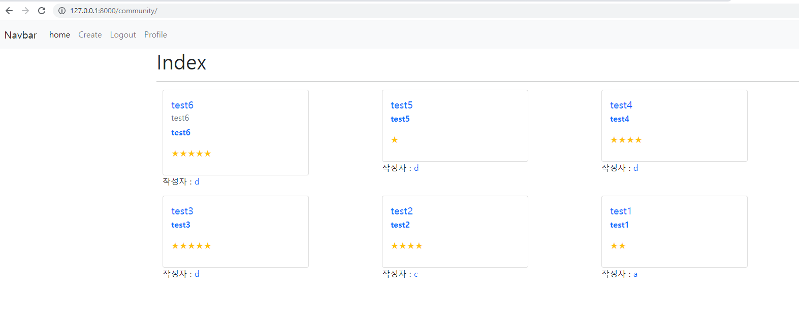
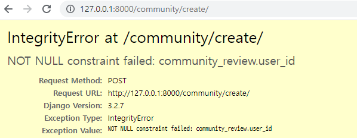
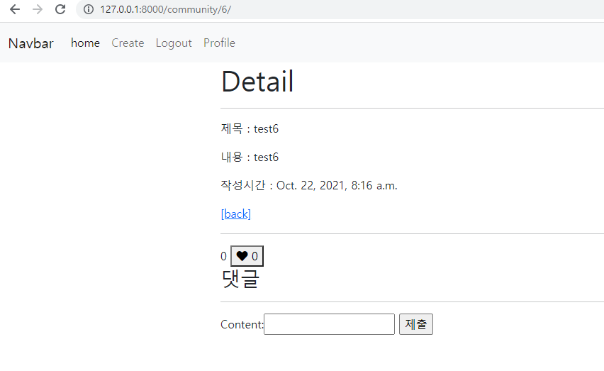
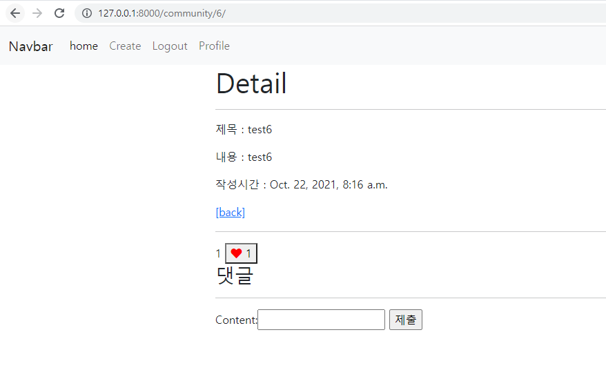

# PJT 07

## 🔔 목표

➕ 데이터에 대한 CRUD기능을 다룰 수 있는 `Web application` 제작

➕ `Django Web Framework` 를 통한 데이터 조작

➕ `Authentication` 에 대한 이해

➕ Database `1:N`  `M:N`  관계의 이해와 데이터 관계 설정


## ✍ 시작하기 전 생각

📄 알고리즘을 마치고 다시 맛보는 DJango 프로젝트인데 이전에 알았던 내용을 까먹지 않았을까 걱정이 된다.

📄 다이어그램으로 모델의 구조를 알아봤는데 흡사 알고리즘을 보는 듯 했다.

📄 1:N, M:N 관계가 생각보다 금방 익혀지지 않아서 프로젝트를 진행하면서 감을 잡아야 할 것 같다.


### A. 프로젝트 구조

❔ 프로젝트 구조 이해하기

💯 `venv` ,  `django`  등을 이용해 프로젝트 기본 구조 만들기

```bash
# 가상환경 폴더 생성
python -m venv venv

# 가상환경 활성화
source venv/Scripts/activate

# django 설치
pip install django

# 프로젝트 생성 (해당 프로젝트에서는 편의상 config로 작성했습니다.)
django-admin startproject pjt07 .

# 어플리케이션 생성
python manage.py startapp community
python manage.py startapp accounts
# 이후 settings.py - 'INSTALLED_APPS'에 'community', 'accounts', 작성

# settings.py 에서 'auth_User'인 디폴트값을 'accounts_User'로 설정
AUTH_USER_MODEL = 'accounts.User'
```

✔ startapp 명령어를 사용할 때 `django-admin` 인지 `python manage.py` 인지 혼동이 있었다.

✔ 위에 작성한 것 처럼 `settings.py` 에서 커스텀 유저 모델을 추가적으로 설정했다.


### B. Signup / Login

❔ 사용자 인증 관리

💯 서버를 이용하기 위한 회원가입 / 로그인-아웃 구성

```python
@require_http_methods(['GET', 'POST'])
def signup(request):
    if not request.user.is_authenticated:
        if request.method == 'POST':
            form = CustomUserCreationForm(request.POST)
            if form.is_valid():
                user = form.save()
                auth_login(request, user)
                return redirect('community:index')
        else:
            form = CustomUserCreationForm()
        context = {
            'form': form,
        }
        return render(request, 'accounts/signup.html', context)
    else:
        return redirect('community:index')


@require_http_methods(['GET', 'POST'])
def login(request):
    if not request.user.is_authenticated:
        if request.method == 'POST':
            form = AuthenticationForm(request, request.POST)
            if form.is_valid():
                # user = form.save()
                auth_login(request, form.get_user())
                return redirect(request.GET.get('next') or 'community:index')
        else:
            form = AuthenticationForm()
        context = {
            'form': form,
        }
        return render(request, 'accounts/login.html', context)
    else:
        return redirect('community:index')
```

✔ `signup` 과 `login` 은 큰 틀은 비슷해서 다른 부분에 비해 소요 시간이 적었다.

✔ `views.login` 에서 auth_login~return 구문에서 착오가 있어 점검 중간에 로그인이 안되는 현상이 있었다.


### C. Profile

❔ `Django ORM queryset` 이해

💯 팔로우 기능 구현 

```python
def follow(request, username):
    person = get_object_or_404(get_user_model(), username=username)
    if person.followers.filter(pk=request.user.pk).exists():
        person.followers.remove(request.user)
    else:
        person.followers.add(request.user)
    return redirect('accounts:profile', person.username)
```

✔ ORM 쿼리셋을 간만에 사용해봤는데 익숙하지가 않아서 그런지 바로바로 생각이 나질 않았다.

✔ 프로필 화면을 구성해놓고 해당 링크를 걸어놓지 않아 주소창에 직접 주소를 작성 해야만 프로필을 볼 수 있는 일종의 해프닝이 있었다.


### D. Index

❔ Bootstrap 활용

💯 `card` 를 이용한 인덱스 정렬

```python
def index(request):
    reviews = Review.objects.order_by('-pk')
    context = {
        'reviews': reviews,
    }
    return render(request, 'community/index.html', context)
```

✔ 기존에는 추가적인 스타일링 없이 for문을 이용해 정렬을 했었는데 이번에는 부트스트랩의 카드와 그리드를 이용해 스타일링을 해봤다.

✔ 카드의 크기를 정해놓은 것이 아니여서 소제목이 없는 리뷰의 경우 크기가 작아져 보기에 불편한 감이 없지않아 있었다.




### E. Create

❔ `Create` 기능 이해

💯 새로운 리뷰 작성 페이지 구성

```python
@require_http_methods(['GET', 'POST'])
@login_required
def create(request):
    if request.method == 'POST':
        form = ReviewForm(request.POST)
        if form.is_valid():
            review = form.save(commit=False)
            review.user = request.user
            review.save()
            return redirect('community:detail', review.pk)
    else:
        form = ReviewForm()
    context = {
        'form': form,
    }
    return render(request, 'community/create.html', context)
```

✔ `commit=False` 구문을 넣지 않아 `IntegrityError` 가 났었다.




### F. Detail

❔ pk에 대한 이해

💯 상세 리뷰 항목 작성

```python
@require_safe
def detail(request, review_pk):
    review = get_object_or_404(Review, pk=review_pk)
    comment_form = CommentForm()
    comments = review.comment_set.all()
    context = {
        'review': review,
        'comment_form': comment_form,
        'comments': comments,
    }
    return render(request, 'community/detail.html', context)
```






## 🔎 자가 진단

❕ 중간 점검을 하면서 에러를 해결하는 속도는 전보다 빨라졌지만, 아직 처음 작성하는 동안 사소한 부분을 놓치는 경우가 많았다.

❕ 이번에는 시간이 얼마 안남았어도 조금이라도 스타일링을 해보려고 시도해봤는데, 결과적으로 좋은 결과가 나왔다. 역시 일단 건드려라도 보는 것이 도움이 많이 되는 것 같다.

❕ PJT를 하기 전 혼자 코드를 건드릴 때는 `NoReverseMatch` 에러가 수도 없이 떴는데 오늘은 한번도 보이지 않아서 나름 기분이 좋았다.


## 💾 추가 html 코드

```html
 detail.html 
<form action="" method='POST'>
  
  <span>{{ review.like_users.all|length }}</span>
  
    <button><i class="fas fa-heart" style='color: red'></i>  {{review.like_users.all|length}}</button>
    
    <button><i class="fas fa-heart"></i>  {{review.like_users.all|length}}</button>
  
</form>
<h3>댓글</h3>

  <p>{{ comments|length }}개의 댓글이 있습니다.</p>

<ul>
  
    <li>{{ comment.user }}: {{ comment.content }}</li>
  
</ul>
<hr>

  <form action="" method="POST">
    
    {{ comment_form }}
    <input type="submit">
  </form>

  <a href="">login</a>


```

